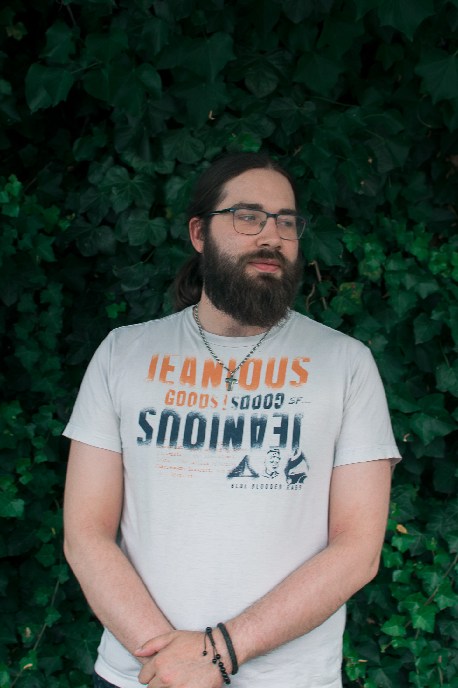

# Valentin Georis

*Don’t dream about success. Get out there and work for it.*

## Lazy but efficient

A table with the following structure:

|                    |            |
|--------------------|------------|
| Birthday           | 08/06      |
| Favorite Color     | Red        |
| Favorite Food      | Spaghettis |
| Pineapple on Pizza | [ ]        |

## Hobbies

- Reading
- Video Games
    - RPGs
    - MMORPGs
- Music
    - Rock
    - Folk

## You can always count on me when...

...you are in trouble, feel lost or don't understand something specific, or...

...you need a laugh; I can crack a good (in my opinion, some might differ) joke, or...

...you don't know where to look for an information; I will do my best to guide you without providing you the straight answer, or...

...you need someone to talk to; I believe I am a good listener, and I want to help if I can !

## A funny story

When I was in 3rd grade, we went for a school trip in the Dutch part of Belgium. Already at the time, I was known for disliking the language, but it was a mandatory trip so I just rolled along, trying to not appear too much bored. Suddenly, my knee gave up and I could not walk anymore; I had to be put in a train to get back home early. I had to get a few days rest so I couldn't attend school either afterwards. 
However, the school believed that I did not have any problem with my knee and that it was all a scene in order to disturb the school trip. In the end, they ended up expelling me from the school due to that.

### TL;DR

My knee gave up during a school trip, and I got expelled from the school for it.

[<< previous](https://github.com/TanguyC0/markdown-challenge) || VALENTIN GEORIS || [next >>](https://github.com/Vittoria-P/markdown-challenge)